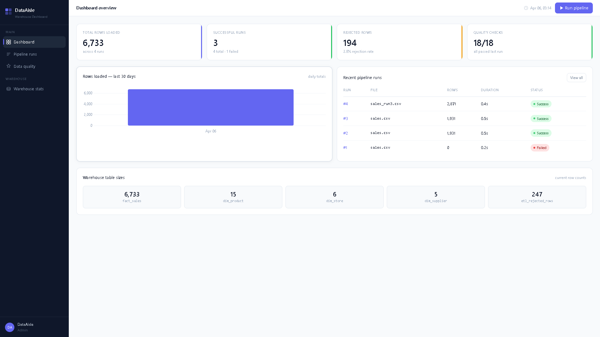
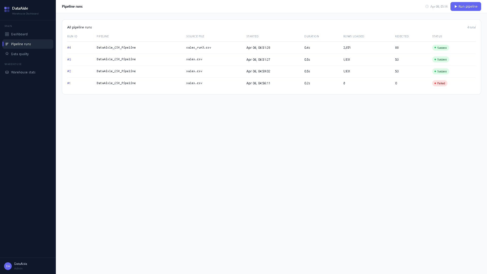
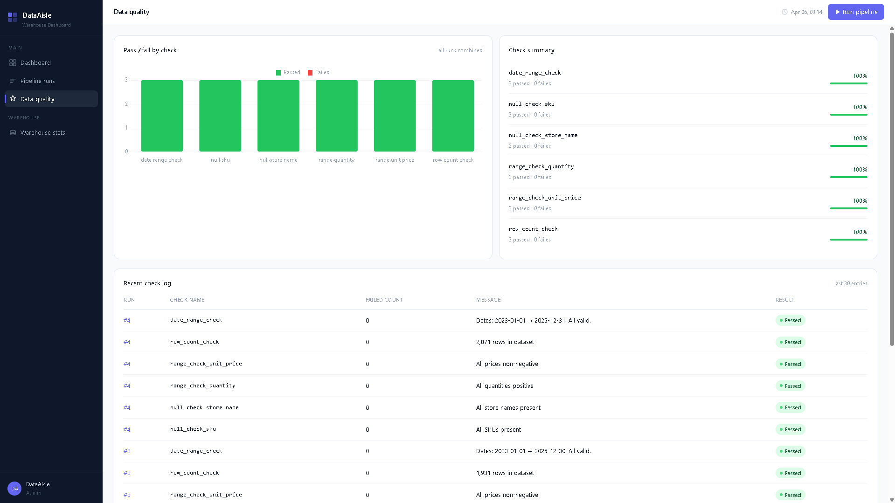
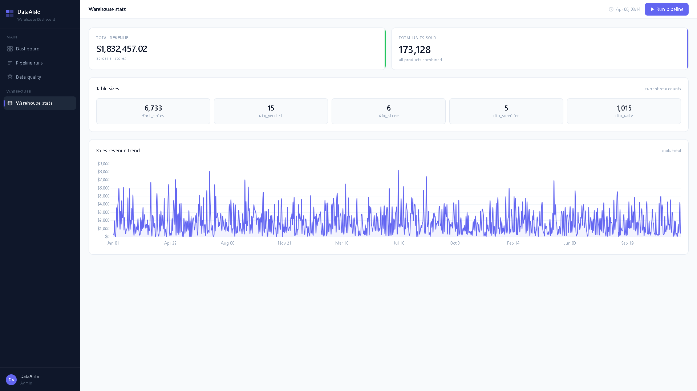

# DataAisle — ETL Pipeline & Warehouse Dashboard

A full-stack data engineering project built with Python, SQL Server, and ASP.NET Core. DataAisle ingests retail sales data from CSV files and APIs, transforms and validates it, loads it into a star-schema data warehouse, and visualises everything in a clean web dashboard.

---

## Screenshots

### Dashboard


### Pipeline runs


### Data quality


### Warehouse stats

---

## Tech Stack

| Layer | Technology |
|---|---|
| ETL Pipeline | Python 3.11, pandas, pyodbc, SQLAlchemy |
| Data Warehouse | SQL Server Express 2022 (LocalDB) |
| Schema | Star schema — fact/dimension tables |
| Web App | ASP.NET Core 8 MVC, Dapper |
| Charts | Chart.js |
| Styling | Custom CSS — no Bootstrap |

---

## Project Structure

```
DataAisle/
├── DataAisle.Database/
│   └── 001_dataaisle_schema.sql      # Star schema + ETL metadata tables
│
├── DataAisle.Pipeline/               # Python ETL pipeline
│   ├── main.py                       # Orchestrator — runs all 5 steps
│   ├── config.py                     # DB connection + path config
│   ├── generate_sample_data.py       # Generates fake retail sales CSV
│   ├── ingest/
│   │   ├── csv_reader.py             # Reads + validates CSV files
│   │   └── api_reader.py             # Open Food Facts API enrichment
│   ├── transform/
│   │   ├── cleaner.py                # Type casting, null handling, deduplication
│   │   └── dimension_mapper.py       # Resolves FK IDs for all dimensions
│   ├── quality/
│   │   └── checks.py                 # 6 data quality checks logged to DB
│   └── load/
│       └── sql_loader.py             # Bulk inserts into SQL Server
│
└── DataAisle.Web/                    # ASP.NET Core MVC dashboard
    ├── Controllers/Controllers.cs    # Dashboard, Runs, Quality, Warehouse
    ├── Models/Models.cs              # C# view models
    ├── Repositories/
    │   └── DashboardRepository.cs   # All Dapper SQL queries
    ├── Views/
    │   ├── Dashboard/Index.cshtml   # KPI cards + daily load chart
    │   ├── Runs/Index.cshtml        # Pipeline run history table
    │   ├── Runs/Detail.cshtml       # Individual run + quality checks
    │   ├── Quality/Index.cshtml     # Pass/fail Chart.js bar chart
    │   └── Warehouse/Index.cshtml   # Table sizes + sales trend chart
    └── wwwroot/
        ├── css/site.css             # Full custom design system
        └── js/animations.js         # Counter animations + Chart.js defaults
```

---

## Database Schema (Star Schema)

```
                    ┌─────────────┐
                    │  dim_date   │
                    └──────┬──────┘
                           │
┌──────────────┐    ┌──────┴──────┐    ┌───────────────┐
│  dim_product │────│ fact_sales  │────│   dim_store   │
└──────────────┘    └──────┬──────┘    └───────────────┘
                           │
                    ┌──────┴──────┐
                    │dim_supplier │
                    └─────────────┘

ETL Metadata:
  etl_pipeline_runs       — one row per pipeline execution
  etl_data_quality_log    — quality check results per run
  etl_rejected_rows       — bad rows with rejection reasons
```

---

## Getting Started

### Prerequisites

- Python 3.11 (via Anaconda)
- SQL Server Express 2022 / LocalDB
- SSMS (SQL Server Management Studio)
- .NET 8 SDK

### 1. Database setup

Open SSMS and run:
```
DataAisle.Database/001_dataaisle_schema.sql
```

### 2. Python environment

```bash
conda create -n dataaisle python=3.11 -y
conda activate dataaisle
pip install pandas==2.2 sqlalchemy==2.0 pyodbc==5.1.0 python-dotenv==1.0.0 requests==2.31.0 faker==24.0.0
```

### 3. Configure the pipeline

```bash
cd DataAisle.Pipeline
copy .env.example .env
# Edit .env — set DA_SQL_SERVER to your LocalDB instance name
```

### 4. Generate sample data and run the pipeline

```bash
python generate_sample_data.py
python main.py
```

### 5. Run the web app

```bash
cd ../DataAisle.Web
dotnet run
```

Open `http://localhost:5144` in your browser.

---

## ETL Pipeline — How It Works

```
CSV / API
   │
   ▼
ingest/csv_reader.py      — load raw data, validate columns
   │
   ▼
transform/cleaner.py      — type cast, null check, deduplicate, reject bad rows
   │
   ▼
quality/checks.py         — 6 checks logged to etl_data_quality_log
   │
   ▼
transform/dimension_mapper.py  — upsert dims, resolve FK IDs
   │
   ▼
load/sql_loader.py        — bulk insert into fact_sales (500 rows/batch)
   │
   ▼
etl_pipeline_runs         — status, row counts, duration recorded
```

---

## Dashboard Features

- **KPI cards** — total rows loaded, successful runs, rejected rows, quality check pass rate
- **Daily load chart** — Chart.js bar chart of rows ingested per day
- **Pipeline runs table** — sortable run history with status badges
- **Run detail page** — per-run quality checks, rejected row count, error messages
- **Data quality page** — stacked pass/fail bar chart + progress bars per check
- **Warehouse stats** — table row counts + full sales revenue trend line chart
- **Run pipeline button** — triggers the Python ETL directly from the browser

---

## Design

Mixed theme dashboard — dark navy sidebar (`#0f172a`) with clean white content area. No Bootstrap. Built with a custom CSS design system featuring smooth animations, staggered table row entry, KPI counter animations, and Chart.js with custom styling.

---

## Author

Built by Tirth Doshi as a full-stack data engineering portfolio project.
